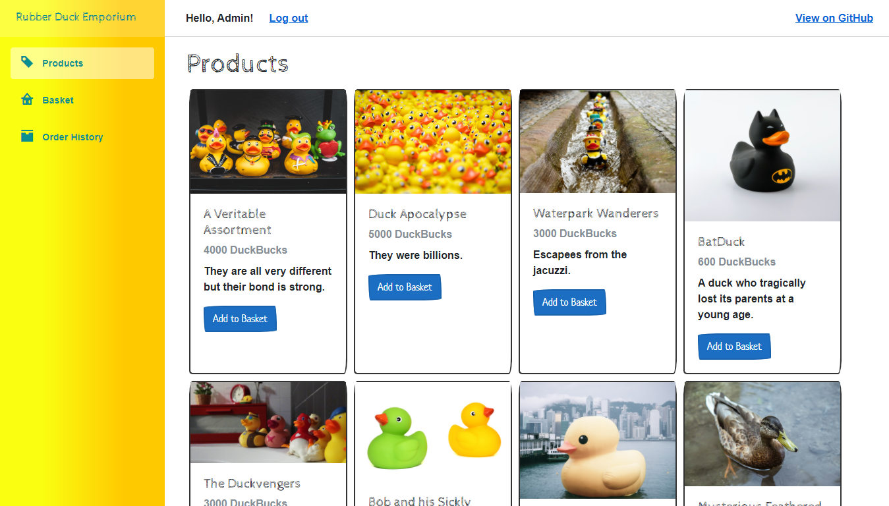

# The Rubber Duck Emporium

A retail application for a rubber duck shop. Made with Blazor WebAssembly.



## Built With

- [.NET 5](https://dotnet.microsoft.com/download/dotnet/5.0)
- [Blazor WebAssembly](https://dotnet.microsoft.com/apps/aspnet/web-apps/blazor)
- [Entity Framework Core 5](https://docs.microsoft.com/en-us/ef/core/)
- [Blazored Toast](https://github.com/Blazored/Toast)
- [Blazored Local Storage](https://github.com/Blazored/LocalStorage)
- [Humanizer](https://github.com/Humanizr/Humanizer)

## How to Run

Make sure you have the .NET 5 SDK installed and then run the following:

```
git clone https://github.com/Lewis-Allen/The-Rubber-Duck-Emporium.git
cd The-Rubber-Duck-Emporium
dotnet run --project RubberDuckEmporium/Server/RubberDuckEmporium.Server.csproj
```